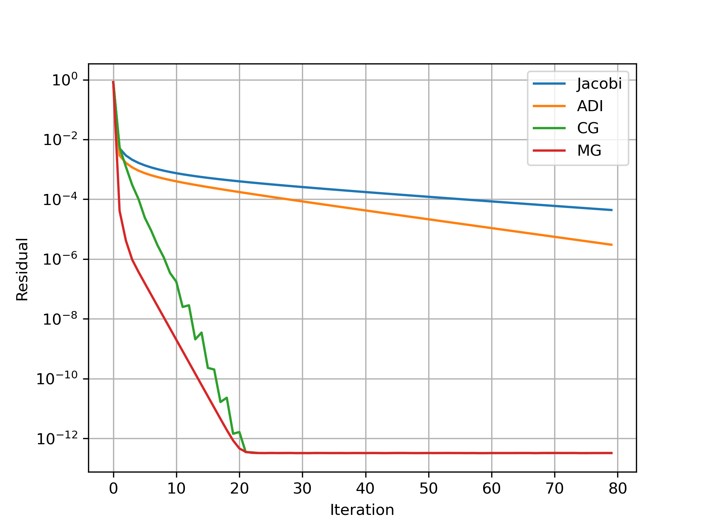

# Solving Poisson equation 

I implement algorithms to solve the Poisson equation $k_c \nabla^2 T = k_c(2 + 2 y / 9 )$. The solution to this set of equations is $T = 300.0 + x^2 + (y/3)^3$. These equations are to be solved a on a rectangular domain $(0,0) \leq (x,y) \leq (1,3)$. The boundary conditions are Dirichlet on all sides. The finite volume method is used to discretize the equations on $nx \times ny$ cells. The discretization of the grid is expected to be such that $dx = dy$, so you would need $ny = 3 \; nx$. The discretized equation at each cell becomes
```math
    k_c \left (T_{i,j-1} + T_{i,j+1} + T_{i-1,j} + T_{i+1,j} - 4.0 * T_{i,j} \right ) = k_c \left ( 2.0 + 2.0 * y / 9.0 \right ) dx \; dy.
```
These equations are solved using the Newton-Raphson method and Alternating Direction Implicity scheme as follows. The residual $R$ at each cell is
```math
 R_{i,j} =  k_c \left (T_{i,j-1} + T_{i,j+1} + T_{i-1,j} + T_{i+1,j} - 4.0 * T_{i,j} \right ) - k_c \left ( 2.0 + 2.0 * y / 9.0 \right ) dx \; dy.
```
The Newton-Raphson iteration for each compuation of the residual $R$ with a given field $T$ produces an update $\Delta T$ as 
```math
\frac{\partial R}{\partial T} \Delta T = -R.
```
The Jacobian $ \frac{\partial R}{\partial T}$ is stored in a 2-D array $J$ of shape $(nx,ny,5)$ where the last index stores the derivatives of the residual $R_{ij}$ with respect to the state variable $T$ at $i,j$, $i-1,j$, $i+1,j$, $i,j-1$, $i,j+1$ in that order.


### Linear Solvers

The framework includes several linear solvers:

1. **Jacobi Solver**: Simple iterative solver 

2. **ADI (Alternating Direction Implicit)**: This isn't so great when the mesh resolution increases. May be it will be better than other approaches for stretched RANS meshes with thin boundary layers. Perhaps as a bottom solver with multigrid?

3. **CG (Conjugate Gradient)**: Iterative method for symmetric positive definite systems. Likely need a Biconjugate gradient algorithm in the future for non symmetric positive definite systems like the momentum equation.

4. **Multigrid**: Hierarchical solver with excellent convergence properties for elliptic equations. I've always know multigrid is good. It's not until I implemented it did I realize how good this is! Damn!

On a side note, getting the L2 norm of an array to calculate the residual is a reduction problem. Efficient implementation of reduction operations are really tricky for newbies with warp shuffles upto a certain level until atomic operations become cheaper. I'm so glad the thrust library from Nvidia was available for me to move past this critical step.

Here's a plot comparing the convergence of the 4 different solvers on the the Poisson equation with `128 x 384` cells. As expected multigrid performs exceedingly well.



*Figure 1: Convergence of different linear solvers for Poisson equation on 128 x 384 grid.*